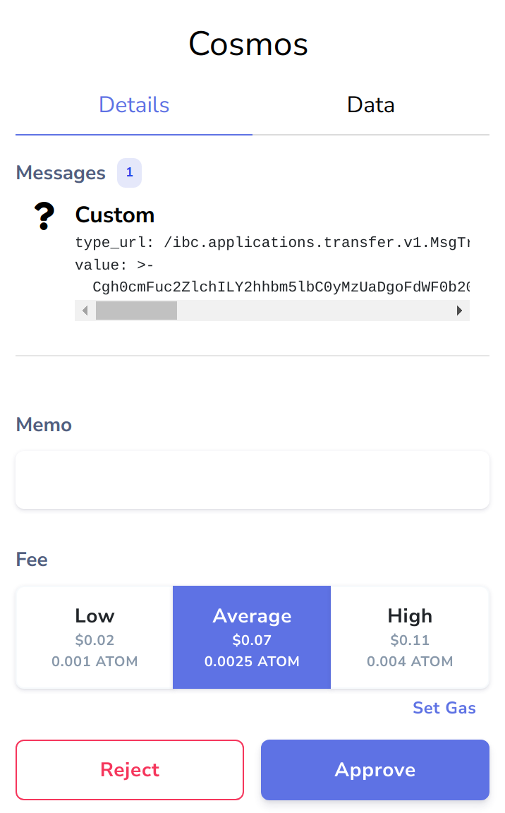

# stridejs

## Table of Contents

- [stridejs](#stridejs)
  - [Table of Contents](#table-of-contents)
  - [Installation](#installation)
  - [Basic Usage](#basic-usage)
  - [Integrations](#integrations)
    - [Keplr Wallet](#keplr-wallet)
      - [`Signer` vs `SignerAuto` vs `SignerOnlyAmino`](#signer-vs-signerauto-vs-signeronlyamino)
        - [`window.keplr.getOfflineSignerOnlyAmino()`](#windowkeplrgetofflinesigneronlyamino)
        - [`window.keplr.getOfflineSigner()`](#windowkeplrgetofflinesigner)
        - [`window.keplr.getOfflineSignerAuto()`](#windowkeplrgetofflinesignerauto)
    - [Leap Cosmos Wallet](#leap-cosmos-wallet)
    - [Ledger](#ledger)
  - [StrideClient](#strideclient)
    - [Creating a Client](#creating-a-client)
      - [Parameters](#parameters)
    - [Properties](#properties)
    - [Methods](#methods)
      - [signAndBroadcast](#signandbroadcast)
  - [IBC Types \& Functions](#ibc-types--functions)
    - [IBC Response Types](#ibc-response-types)
    - [IBC Transfer Functions](#ibc-transfer-functions)
      - [ibcDenom](#ibcdenom)
      - [getTxIbcResponses](#gettxibcresponses)
      - [findIbcResponse](#findibcresponse)
      - [getTxIbcResponses](#gettxibcresponses-1)
  - [Address \& Key Functions](#address--key-functions)
    - [Bech32 Functions](#bech32-functions)
      - [convertBech32Prefix](#convertbech32prefix)
    - [Public Key Functions](#public-key-functions)
      - [pubkeyToAddress](#pubkeytoaddress)
      - [base64PubkeyToAddress](#base64pubkeytoaddress)
    - [Validator Functions](#validator-functions)
      - [selfDelegatorAddressToValidatorAddress](#selfdelegatoraddresstovalidatoraddress)
      - [validatorAddressToSelfDelegatorAddress](#validatoraddresstoselfdelegatoraddress)
      - [tendermintPubkeyToValconsAddress](#tendermintpubkeytovalconsaddress)
      - [base64TendermintPubkeyToValconsAddress](#base64tendermintpubkeytovalconsaddress)
  - [Coin \& Fee Functions](#coin--fee-functions)
      - [coinFromString](#coinfromstring)
      - [coinsFromString](#coinsfromstring)
      - [feeFromGas](#feefromgas)
  - [Event Functions](#event-functions)
      - [getValueFromEvents](#getvaluefromevents)
  - [Encoding Functions](#encoding-functions)
      - [Base64](#base64)
      - [Hex](#hex)
      - [ASCII](#ascii)
      - [UTF8](#utf8)
      - [RFC3339 Date](#rfc3339-date)
  - [Helper Functions](#helper-functions)
      - [decToString](#dectostring)
      - [sleep](#sleep)

## Installation

```bash
npm install stridejs
```

## Basic Usage

```typescript
import { StrideClient, DirectSecp256k1HdWallet, GasPrice } from "stridejs";

// Create a wallet from mnemonic
const signer = await DirectSecp256k1HdWallet.fromMnemonic(mnemonic, {
  prefix: "stride",
});

// Get the address from the wallet
const [{ address }] = await signer.getAccounts();

// Create a StrideClient instance
const client = await StrideClient.create(
  "http://stride-rpc.example.com:26657",
  signer,
  address,
  {
    gasPrice: GasPrice.fromString("0.025ustrd"),
  },
);
```

## Integrations

### Keplr Wallet

The recommended way of integrating Keplr is by using `window.keplr.getOfflineSignerOnlyAmino()`:

```typescript
import { StrideClient, sleep, GasPrice } from "stridejs";

while (!window.keplr || !window.keplr?.getOfflineSignerOnlyAmino) {
  await sleep(50);
}

const CHAIN_ID = "stride-1";

await window.keplr.enable(CHAIN_ID);

const signer = window.keplr.getOfflineSignerOnlyAmino(CHAIN_ID);
const [{ address }] = await signer.getAccounts();

const stridejs = new StrideClient.create(
  "http://stride-rpc.example.com:26657",
  signer,
  address,
  {
    gasPrice: GasPrice.fromString("0.025ustrd"),
  },
);
```

Links:

- <a href="https://www.keplr.app" target="_blank"><strong>Official Keplr Website »</strong></a>
- <a href="https://docs.keplr.app/api" target="_blank"><strong>Keplr API Docs »</strong></a>

#### `Signer` vs `SignerAuto` vs `SignerOnlyAmino`

**TL;DR**:

- [`getOfflineSignerOnlyAmino()`](#windowkeplrgetofflinesigneronlyamino): The recommended way. Supports Ledger, has a nice UI.
- [`getOfflineSigner()`](#windowkeplrgetofflinesigner): No Ledger support, ugly UI, can send IBC **relayer** txs and submit IBC gov proposals.
- [`getOfflineSignerAuto()`](#windowkeplrgetofflinesignerauto): If Ledger alias for `getOfflineSignerOnlyAmino()`, otherwise alias for `getOfflineSigner()`.

---

##### `window.keplr.getOfflineSignerOnlyAmino()`

Although this is the legacy way of signing transactions on cosmos-sdk chains, it's still the most recommended for connecting to Keplr due to Ledger support & better UI on Keplr.

- 🟩 Looks good on Keplr
- 🟩 Supports users signing with Ledger
- 🟥 Doesn't support signing these transactions:
  - Every tx type under `ibc.client`, `ibc.connection` and `ibc.channel` (meaning IBC relaying, for example with [ts-relayer](https://github.com/confio/ts-relayer))

Note that `ibc.applications.transfer.v1.MessageComposer.withTypeUrl.transfer` for sending funds across IBC **is** supported.


##### `window.keplr.getOfflineSigner()`

The new way of signing transactions on cosmos-sdk chain, it's more efficient but still doesn't have Ledger support. It's most recommended for usage in apps that don't require signing transactions with Ledger.

- 🟥 Looks bad on Keplr
- 🟥 Doesn't support users signing with Ledger
- 🟩 Supports signing transactions with all types of messages



##### `window.keplr.getOfflineSignerAuto()`

If the connected Keplr account uses Ledger, returns `window.keplr.getOfflineSignerOnlyAmino()`.  
Otherwise returns `window.keplr.getOfflineSigner()`.

### Leap Cosmos Wallet

The recommended way of integrating Leap is by using `window.leap.getOfflineSignerAmino()`:

```ts
import { StrideClient, sleep, GasPrice } from "stridejs";

while (!window.leap || !window.leap?.getOfflineSignerOnlyAmino) {
  await sleep(50);
}

const CHAIN_ID = "stride-1";

await window.leap.enable(CHAIN_ID);

const signer = window.leap.getOfflineSignerOnlyAmino(CHAIN_ID);
const [{ address }] = await signer.getAccounts();

const stridejs = new StrideClient.create(
  "http://stride-rpc.example.com:26657",
  signer,
  address,
  {
    gasPrice: GasPrice.fromString("0.025ustrd"),
  },
);
```

Links:

- <a href="https://www.leapwallet.io/cosmos" target="_blank"><strong>Official Leap Website »</strong></a>
- <a href="https://docs.leapwallet.io/cosmos/for-dapps-connect-to-leap/introduction" target="_blank"><strong>Leap API Docs »</strong></a>

### Ledger

`LedgerSigner` can be used to sign transactions with a Ledger wallet running the Cosmos app.

```ts
import { StrideClient, makeCosmoshubPath, LedgerSigner } from "stridejs";

// NodeJS only
import TransportNodeHid from "@ledgerhq/hw-transport-node-hid";

// Browser only
//import TransportNodeHid from "@ledgerhq/hw-transport-webusb";

const interactiveTimeout = 120_000;
const accountIndex = 0;
const cosmosPath = makeCosmoshubPath(accountIndex);

const ledgerTransport = await TransportNodeHid.create(
  interactiveTimeout,
  interactiveTimeout,
);
const signer = new LedgerSigner(ledgerTransport, {
  testModeAllowed: true,
  hdPaths: [cosmosPath],
  prefix: "stride",
});
const [{ address }] = await signer.getAccounts();

const stridejs = new StrideClient.create(
  "http://stride-rpc.example.com:26657",
  signer,
  address,
  {
    gasPrice: GasPrice.fromString("0.025ustrd"),
  },
);
```

Links:

- <a href="https://cosmos.github.io/cosmjs/latest/ledger-amino/" target="_blank"><strong>`@cosmjs/ledger-amino` Documentation »</strong></a>

## StrideClient

### Creating a Client

```typescript
const client = await StrideClient.create(
  rpcUrl: string,
  signer: OfflineSigner,
  address: string,
  options?: StrideClientOptions
)
```

#### Parameters

- `rpcUrl`: URL to the CometBFT RPC endpoint
- `signer`: Signer for signing transactions
- `address`: Account address that can sign transactions
- `options`: Optional configuration object:
  ```typescript
  type StrideClientOptions = {
    gasPrice?: GasPrice;
    registry?: Registry;
    aminoTypes?: AminoTypes;
    broadcastTimeoutMs?: number; // default: 60_000,
    broadcastPollIntervalMs?: number; // default: 3_000,
    resolveIbcResponsesTimeoutMs?: number; // default: 180_000
    resolveIbcResponsesCheckIntervalMs?: number; // default: 12_000
  };
  ```

### Properties

```typescript
class StrideClient {
  readonly rpcEndpoint: string;
  readonly signer: OfflineSigner;
  readonly address: string;
  readonly signingStargateClient: SigningStargateClient;
  readonly query: QueryClient & AuthExtension & BankExtension & more;
  readonly options?: StrideClientOptions;
}
```

### Methods

#### signAndBroadcast

```typescript
async signAndBroadcast(
  messages: readonly EncodeObject[],
  fee: StdFee | "auto" | number = "auto", // defaults to "auto" - simulates the tx and uses 1.4 as gas limit multiplier
  memo: string = ""
): Promise<DeliverTxResponse & { ibcResponses: Array<Promise<IbcResponse>> }>
```

Signs and broadcasts transaction(s). Returns transaction response with IBC acknowledgements if there are any.

Example:

```typescript
import { coinsFromString, cosmos, getValueFromEvents, ibc } from "stridejs";

// Send tokens
const sendTx = await client.signAndBroadcast(
  [
    cosmos.bank.v1beta1.MessageComposer.withTypeUrl.send({
      fromAddress: client.address,
      toAddress: "stride1...",
      amount: coinsFromString("1000000ustrd"),
    }),
  ],
  "auto", // automatic gas estimation
);
if (sendTx.code === 0) {
  // success
}

// IBC transfer
const ibcTx = await client.signAndBroadcast([
  ibc.applications.transfer.v1.MessageComposer.withTypeUrl.transfer({
    sourcePort: "transfer",
    sourceChannel: "chennel-123",
    token: coinFromString("100000ustrd"),
    sender: "stride1...",
    receiver: "osmo1...",
    timeoutHeight: {
      revisionNumber: 0n,
      revisionHeight: 0n,
    },
    timeoutTimestamp: `${Math.floor(Date.now() / 1000) + 3 * 60}000000000`, // 3min
    memo: "",
  }),
  // defaults to automatic gas estimation
]);

// Wait for IBC acknowledgements
const ibcAck = await ibcTx.ibcResponses[0];

if (
  ibcAck.type === "ack" &&
  ibcAck.tx.code === 0 &&
  getValueFromEvents(ibcAck.tx.events, "fungible_token_packet.success") ===
    "\u0001"
) {
  // success
}
```

## IBC Types & Functions

### IBC Response Types

```typescript
type IbcResponse = {
  type: "ack" | "timeout";
  tx: IndexedTx;
};

type IbcTransferPath = {
  incomingPortId: string;
  incomingChannelId: string;
};
```

### IBC Transfer Functions

#### ibcDenom

```typescript
function ibcDenom(paths: IbcTransferPath[], coinMinimalDenom: string): string;
```

Computes the IBC denom of a token after being sent through IBC channels.

Example:

```typescript
// Get STRD denom on Osmosis after transfer through channel-326
const osmoDenom = ibcDenom(
  [
    {
      incomingPortId: "transfer",
      incomingChannelId: "channel-326",
    },
  ],
  "ustrd",
);

// Get ATOM denom on Stride after transfer through multiple channels
const strideDenom = ibcDenom(
  [
    {
      incomingPortId: "transfer",
      incomingChannelId: "channel-0",
    },
    {
      incomingPortId: "transfer",
      incomingChannelId: "channel-1",
    },
  ],
  "uatom",
);
```

#### getTxIbcResponses

```typescript
function getTxIbcResponses(
  stargateClient: StargateClient,
  txResponse: DeliverTxResponse,
  resolveResponsesTimeoutMs?: number,
  resolveResponsesCheckIntervalMs?: number,
): Array<Promise<IbcResponse>>;
```

Gets IBC acknowledgements or timeouts for an IBC transaction.

Example:

```typescript
const tx = await client.signAndBroadcast([ibcTransferMsg], "auto");
const ibcResponses = await Promise.all(tx.ibcResponses);

for (const resp of ibcResponses) {
  if (resp.type === "ack") {
    console.log("IBC transfer succeeded");
  } else {
    console.log("IBC transfer reverted due to a timeout");
  }
}
```

#### findIbcResponse

```typescript
async function findIbcResponse(
  stargateClient: StargateClient,
  packetSequence: string,
  packetSrcChannel: string,
  type: "ack" | "timeout" = "ack",
  resolveResponsesTimeoutMs: number = 180000,
  resolveResponsesCheckIntervalMs: number = 12000,
  isDoneObject: { isDone: boolean } = { isDone: false },
): Promise<IbcResponse>;
```

Low-level function to search for a specific IBC response. Usually used through `getTxIbcResponses`.

#### getTxIbcResponses

```typescript
function getTxIbcResponses(
  stargateClient: StargateClient,
  txResponse: DeliverTxResponse,
  resolveResponsesTimeoutMs: number = 180000,
  resolveResponsesCheckIntervalMs: number = 12000,
): Array<Promise<IbcResponse>>;
```

This function retrieves IBC acknowledgements or timeouts for a transaction that resulted in sending IBC packets. It returns an array of promises that resolve to `IbcResponse` objects, which can either be acknowledgements (`ack`) or timeouts (`timeout`).

This function is automatically used by `StrideClient` and is intended to be used with a CosmJS `StargateClient`, which may be connected to another chain.

## Address & Key Functions

### Bech32 Functions

#### convertBech32Prefix

```typescript
function convertBech32Prefix(address: string, toPrefix: string): string;
```

Converts a bech32 address from one prefix to another.

Example:

```typescript
// Convert Stride address to Osmosis address
const osmoAddr = convertBech32Prefix("stride1xyz...", "osmo"); // osmo1xyz...

// Convert Stride address to Cosmos Hub address
const cosmosAddr = convertBech32Prefix("stride1xyz...", "cosmos"); // cosmos1xyz...
```

### Public Key Functions

#### pubkeyToAddress

```typescript
function pubkeyToAddress(pubkey: Uint8Array, prefix: string = "stride"): string;
```

Converts a secp256k1 compressed public key to a bech32 address.

#### base64PubkeyToAddress

```typescript
function base64PubkeyToAddress(
  pubkey: string,
  prefix: string = "stride",
): string;
```

Converts a base64 encoded secp256k1 compressed public key to a bech32 address.

### Validator Functions

#### selfDelegatorAddressToValidatorAddress

```typescript
function selfDelegatorAddressToValidatorAddress(
  selfDelegator: string,
  prefix: string = "stride",
): string;
```

Converts a self-delegator address to its validator operator address.

Example:

```typescript
const valoper = selfDelegatorAddressToValidatorAddress(
  "stride1xyz...",
  "stride",
); // stridevaloper1xyz...
```

#### validatorAddressToSelfDelegatorAddress

```typescript
function validatorAddressToSelfDelegatorAddress(
  validator: string,
  prefix: string = "stride",
): string;
```

Converts a validator operator address to its self-delegator address.

#### tendermintPubkeyToValconsAddress

```typescript
function tendermintPubkeyToValconsAddress(
  pubkey: Uint8Array,
  prefix: string = "stride",
): string;
```

Converts a Tendermint ed25519 public key to a validator consensus address.

#### base64TendermintPubkeyToValconsAddress

```typescript
function base64TendermintPubkeyToValconsAddress(
  pubkey: string,
  prefix: string = "stride",
): string;
```

Converts a base64 encoded Tendermint ed25519 public key to a validator consensus address.

## Coin & Fee Functions

#### coinFromString

```typescript
function coinFromString(coinAsString: string): Coin;
```

Converts a string representation of a coin to a `Coin` object.

Example:

```typescript
coinFromString("1000ustrd"); // { amount: "1000", denom: "ustrd" }
coinFromString("2.5atom"); // { amount: "2.5", denom: "atom" }
coinFromString(
  "1000ibc/27394FB092D2ECCD56123C74F36E4C1F926001CEADA9CA97EA622B25F41E5EB2",
);
```

#### coinsFromString

```typescript
function coinsFromString(coinsAsString: string): Coin[];
```

Converts a comma-separated string of coins to an array of `Coin` objects.

Example:

```typescript
coinsFromString("1000ustrd,500uatom");
// [
//   { amount: "1000", denom: "ustrd" },
//   { amount: "500", denom: "uatom" }
// ]
```

#### feeFromGas

```typescript
function feeFromGas(gasLimit: number, gasPrice: number = 0.025): StdFee;
```

Creates a `StdFee` object from gas limit and price.

Example:

```typescript
feeFromGas(200000);
// {
//   amount: [{ amount: "5000", denom: "ustrd" }],
//   gas: "200000"
// }
```

## Event Functions

#### getValueFromEvents

```typescript
function getValueFromEvents(events: readonly Event[], key: string): string;
```

Searches through events to find a specific value based on event type and attribute key.

Example:

```typescript
const events = [
  {
    type: "transfer",
    attributes: [
      { key: "recipient", value: "stride1..." },
      { key: "amount", value: "1000ustrd" },
    ],
  },
];

getValueFromEvents(events, "transfer.recipient"); // "stride1..."
getValueFromEvents(events, "transfer.amount"); // "1000ustrd"
```

## Encoding Functions

#### Base64

```typescript
function fromBase64(base64: string): Uint8Array;
function toBase64(data: Uint8Array): string;
```

Convert between base64 strings and `Uint8Arrays`.

#### Hex

```typescript
function fromHex(hex: string): Uint8Array;
function toHex(data: Uint8Array): string;
```

Convert between hex strings and `Uint8Arrays`.

#### ASCII

```typescript
function fromAscii(ascii: string): Uint8Array;
function toAscii(data: Uint8Array): string;
```

Convert between ASCII strings and `Uint8Arrays`.

#### UTF8

```typescript
function fromUtf8(utf8: string): Uint8Array;
function toUtf8(data: Uint8Array): string;
```

Convert between UTF8 strings and `Uint8Arrays`.

#### RFC3339 Date

```typescript
function fromRfc3339(date: string): Date;
function toRfc3339(date: Date): string;
```

Convert between RFC3339 date strings and `Date` objects.

## Helper Functions

#### decToString

```typescript
function decToString(dec: number): string;
```

Formats a decimal number to Cosmos SDK decimal string format.

Example:

```typescript
decToString(0.5); // "0.500000000000000000"
decToString(1.23); // "1.230000000000000000"
```

#### sleep

```typescript
function sleep(ms: number): Promise<void>;
```

Utility function to pause execution.
